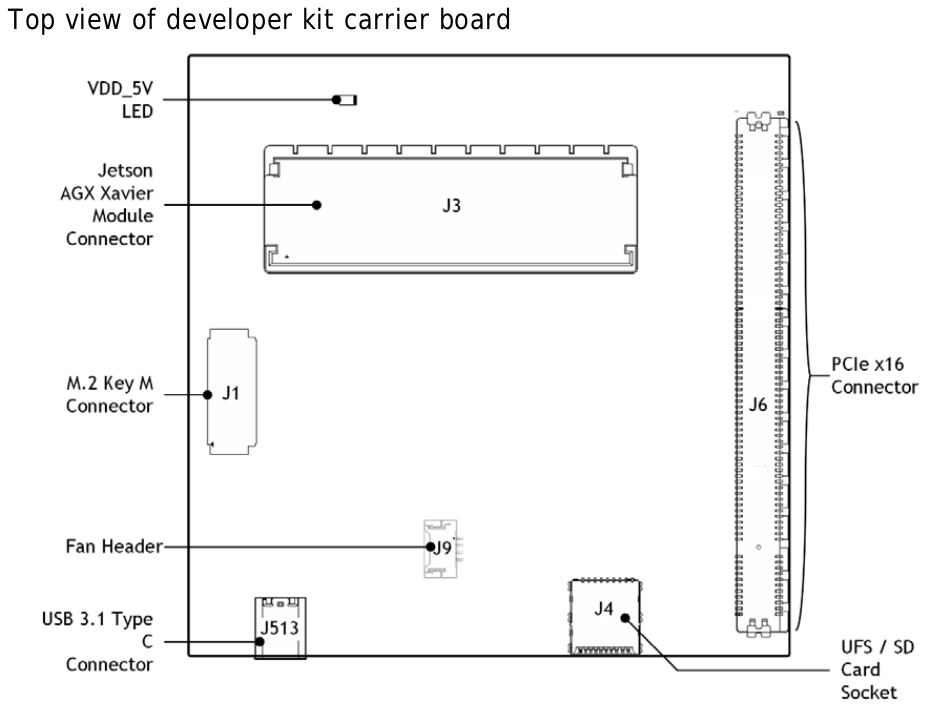
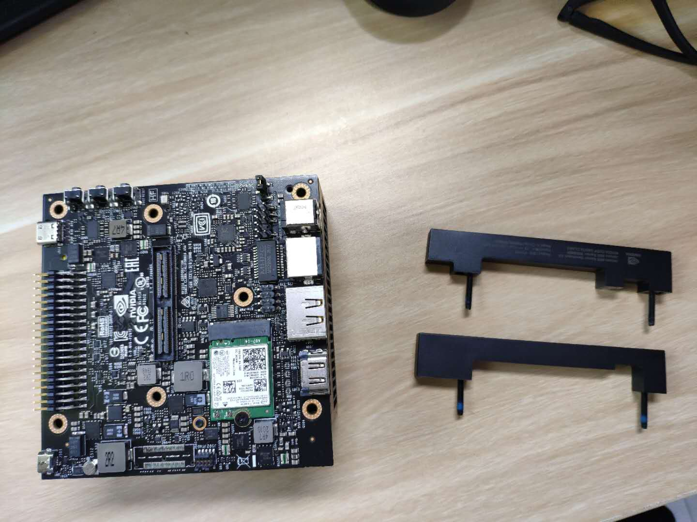
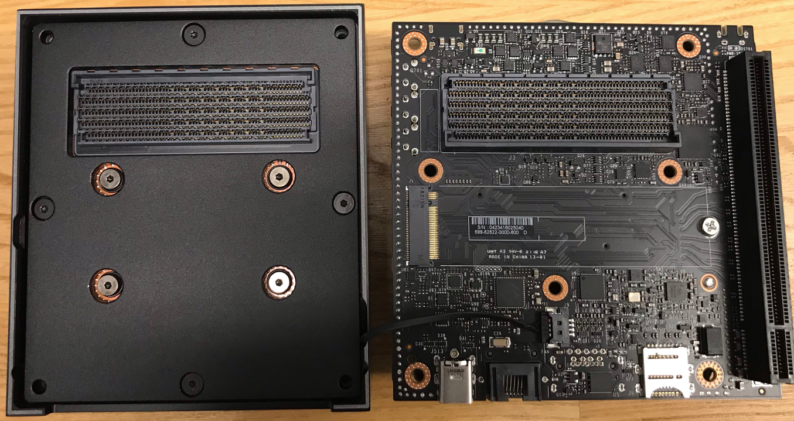
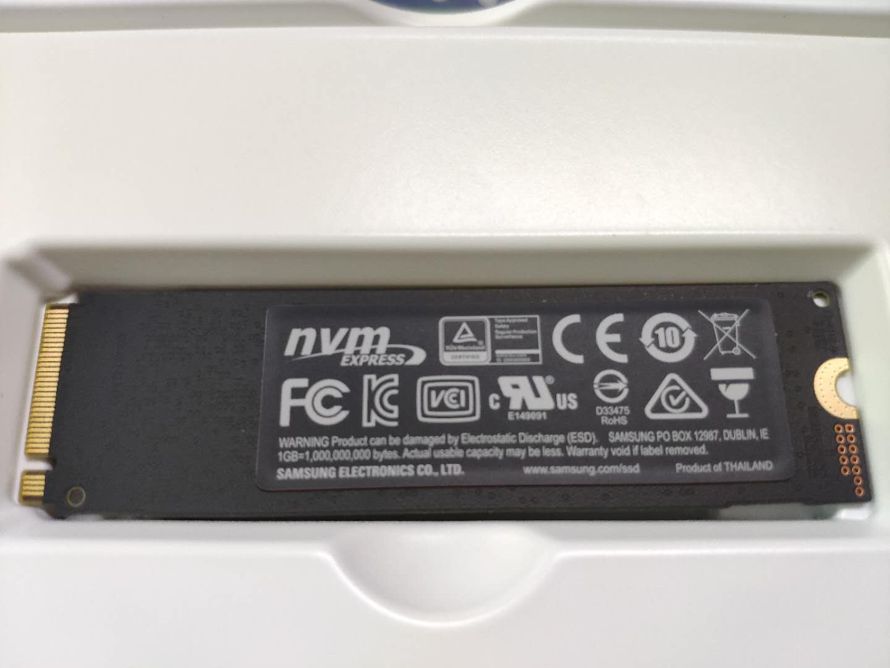
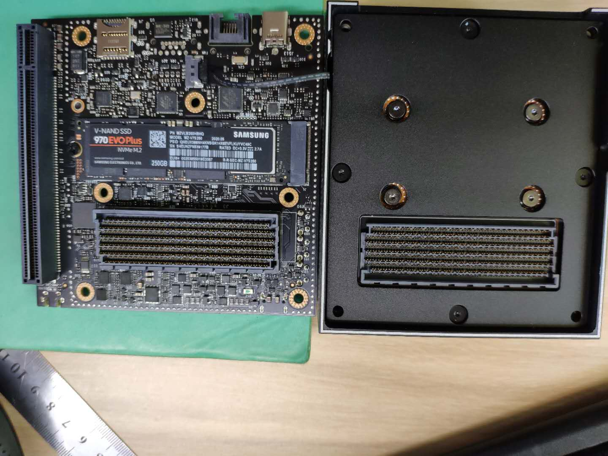

# SSD Installation

## 安装SSD
根据nvidia_agx_xavier_developer_kit_userguide可知,SSD固态硬盘应该安装在J1(M.2 KEY M CONNECTOR)的位置

**1** 移除底部四个螺丝

**2** 将Xavier核心及散热模块同载板分离,注意两层之间的风扇连接线,不要扯断了

**3** 准备NVMe M.2接口的SSD固态硬盘,这是使用的是Samsung 970 EVO Plus, 250G

**4** 安装ssd,并用螺丝固定好

**5** 安装复原,整个过程要小心,不要造成损坏

## 挂载分区

**1** 查看硬盘信息

```bash
sudo fdisk -lu
## or 
lsblk
```
可以看到`/dev/nvme0n1`即是我们安装的SSD固态硬盘

**2** 使用hdparm工具查看读写速度

```bash
## 安装hdparm工具
sudo apt-get install hdparm
## 查看读写速度
sudo hdparm -Tt /dev/nvme0n1
```
**3** 硬盘分区

```bash
sudo fdisk /dev/nvme0n1
```
参照如下操作依次进行
- m - 查看帮助 
- n - 新建分区 
- p - 主分区(primary,这里选择主分区) 
- 1 - 设置分区数(这里设置一个分区) 
- enter - First sector选择默认 
- w - 保存并退出

**4** 分区格式化为ext4

```bash
sudo fdisk -lu
## 显示/dev/nvme0n1p1,表示分区成功
## 进行格式化操作
sudo mkfs -t ext4 /dev/nvme0n1p1
```

**5** 挂载分区

在`/mnt`下创建文件夹`/home`
```bash
cd /mnt
sudo mkdir home
```
将硬盘挂载到`/mnt/home`
```bash
sudo mount /dev/nvme0n1p1 /mnt/home
```

**6** 替换之前的`home`目录

备份之前的`home`目录
```elm
sudo cp -a /home/* /mnt/home
```
删除之前`home`目录,此时桌面菜单栏也会消失
```elm
sudo rm -rf /home/*
```
卸载硬盘
```elm
sudo umount /dev/nvme0n1p1
```

**7** 设置开机自动挂载

打开`/etc/fstab`
```elm
sudo vim /etc/fstab
```
在末尾添加

```bash
/dev/nvme0n1p1    /home   ext4    defaults  0   1
```
保存并退出

**附注:**

`/etc/fstab`文件的格式如下

```bash
<file system>	<dir>	<type>	<options>	<dump>	<pass>
```

其中dump和pass的意义如下:
```
<dump> dump 工具通过它决定何时作备份. dump 会检查其内容，并用数字来决定是否对这个文件系统进行备份。 允许的数字是 0 和 1 。0 表示忽略， 1 则进行备份。大部分的用户是没有安装 dump 的 ，对他们而言 <dump> 应设为 0 
<pass> fsck 读取 <pass> 的数值来决定需要检查的文件系统的检查顺序。允许的数字是0, 1, 和2。 根目录应当获得最高的优先权 1, 其它所有需要被检查的设备设置为 2. 0 表示设备不会被 fsck 所检查。
```
`/etc/fstab`文件的具体内容参见[fstab文件详解](https://www.cnblogs.com/wayneiscoming/articles/7710599.html).

**8** 重启,完成自动挂载

```elm
sudo reboot
```