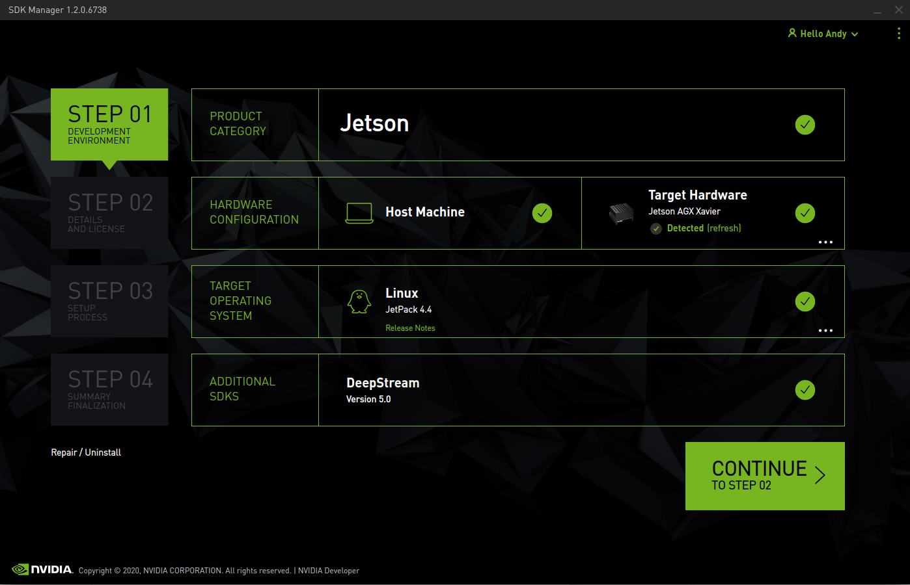

# Xavier Configuration

## 开发套件基本信息
Jetson AGX Xavier Developer Kit的[官方网站](https://developer.nvidia.com/embedded/jetson-agx-xavier-developer-kit)有很多资源.包括[用户手册](https://developer.nvidia.com/embedded/dlc/jetson-agx-xavier-developer-kit-user-guide),[下载中心](https://developer.nvidia.com/embedded/downloads#?search=Jetson%20AGX%20Xavier)等,能够详细了解开发套件的性能参数,硬件接口,软件安装等.


在进行硬件连接前请参考Xavier的用户手册.

- 提前[注册NVIDIA账号](https://developer.nvidia.com/login)
- Ubuntu主机一台(也可以使用虚拟机)
- 自带的电源线
- 自带的USB转Type-c线
- 网线
- HDMI线,显示器
- 键盘鼠标一套

参照用户手册, 开发套件侧边有三个按钮，依次为Power、Force Recovery、Reset。连接完毕后,开机.

**注意**: 

1. 刷机时,请将Xavier前面的type-c口(J512)(led旁边)连接到主机上.
2. 一般来说,xavier自动检测识别,不需要进入recovery模式,如果不能识别,进入recovery模式方法如下(在[用户手册](https://developer.nvidia.com/embedded/dlc/jetson-agx-xavier-developer-kit-user-guide)中有介绍):

> - 保持正确线缆连接,并将Xavier关机
> - 按住中间的Force Recovery按钮,不松手
> - 按住Power按钮,不松手
> - 同时释放两个按钮,则进入force recovery模式


## 主机使用sdk manager给Xavier刷机
### 安装sdk manager
在jetson的下载中心下载最新的sdk manager[sdkmanager](https://developer.nvidia.com/nvidia-sdk-manager)，当前版本为`1.4.1.7402`, 通过sdk manager可以选择不同版本的jetpack来给系统刷机，不同版本的jetpack包含的软件版本不同，当前使用的jetpack版本为`4.5.1`.


参照界面的安装说明进行安装:
```elm
sudo apt install ./sdkmanager-[version].deb
```
**注意**:
1. 安装包名称修改成下载的相应版本
2. [NVIDIA SDK MANAGER](https://docs.nvidia.com/sdk-manager/index.html)
2. NVIDIA SDK MANAGER的详细使用方法可以参考官网[使用说明文档](https://docs.nvidia.com/sdk-manager/install-with-sdkm-jetson/index.html#installation)

### 启动
命令行或者应用程序直接启动sdkmanager,登录nvidia账号.根据网络情况的不同,可能会出现登录不上的情况,请保证网络连接的稳定性,多次登录尝试.

### STEP 01
登录界面后进入step1,可以进行安装配置,包括是否在host machine安装sdk, JetPack版本, jetson类型选择(连接上之后会自动选择), 是否安装DeepStream(不同版本的sdkmanager可能不同)

### STEP 02
选择continue进入step2,可以选择文件下载的地址,以及是否要刷机,安装sdk,可以看到要安装的软件版本,有系统的话可以不选择刷机.

### STEP 03
进入step3时,开始下载所需的镜像和sdks,网络不稳定时可能出现下载失败的情况,可以暂停重新开始来多次尝试,要保证网络的稳定性。
下载完成后会首先刷机,请在Xavier上完成系统设置,设置完成后会提示安装SDKs,使用type-c连接可以使用下面默认的IP192.168.55.1,否则需要在同一局域网下,输入xavier的IP(在xavier上使用ifconfig进行查询),然后输入你设置好的用户名和密码开始安装。此外，请保证xavier也能正确联网，否则在安装sdks时可能因为依赖安装错误失败。


### STEP 04
安装完成后,即可以使用,进行下一步操作.

## Xavier的运行模式
xavier有8中power mode,可以通过桌面右上角图标或者jetson-stats工具修改,同样也可以使用如下命令行进行操作修改.   
**查看power mode配置文件:**

```$ cat /etc/nvpmodel.conf ```

**查看当前的运行模式**

```$ nvpmodel -q --verbose ```

**模式切换**

- **10W Operating Mode**    
    ```bash
    $ nvpmodel -m 1
    ```

- **15W Operating Mode**    

    ```bash
    # 4 CPU
    $ nvpmodel -m 2
    ```

- **30W Operating Mode**    

    ```bash
    # all CPU
    $ nvpmodel -m 3
    # 6 CPU
    $ nvpmodel -m 4
    # 4 CPU
    $ nvpmodel -m 5
    # 2 CPU
    $ nvpmodel -m  6
    ```