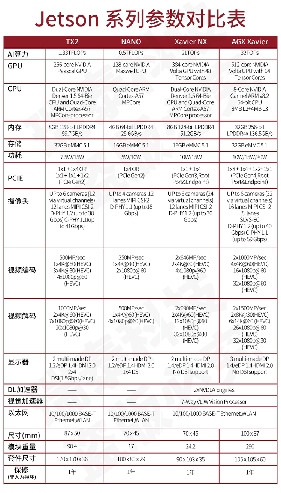

## Xavier Introduction
Xavier的详细信息可以查看其[官方网站](https://developer.nvidia.com/embedded/jetson-agx-xavier-developer-kit).包括[用户手册](https://developer.nvidia.com/embedded/dlc/jetson-agx-xavier-developer-kit-user-guide).
### Jetson产品性能对比
    
[图片引用来源](https://item.taobao.com/item.htm?spm=a1z10.1-c-s.w5003-22531913568.5.722e1d5dKV9NWR&id=619551193067&scene=taobao_shop)

### 性能评测

> Jetson AGX Xavier最厉害的地方在于，其提供了PCIe Gen4 x16以及M.2 PCIe x1通用扩展插槽，可用于连接WiFi或蜂窝网络模块等附加设备，可为傲视群雄。    
> Xavier芯片作为系统的大脑，是NVIDIA迄今为止最大、最复杂的SoC，是Arm生态系统的重量级产品之一，在350mm²的面积上集成了90亿晶体管。Xavier芯片的四周为16GB LPDDR4X内存、 32GB eMMC闪存以及供电模块等其他核心组件。
> Xavier芯片主要由NVIDIA自研的Carmel架构8核64位CPU和Volta架构512 CUDA处理器GPU这两大模块组成，这两部分电路占据了芯片的大部分空间。   
> 8个CPU核心被平均分配为4个集群，每个集群都有一个独立的时钟平面，并在2个CPU核心之间共享2MB L2缓存，在其之上，4个集群共享4MB L3缓存。目前关于全新Carmel架构的信息很少，只知道它是之前Denver架构的继任者，其设计特点是强大的动态代码优化能力。NVIDIA只对外表示Carmel是一个10宽度的超标量架构（10个执行端口， 非10宽度解码），并且支持ARMv8.2+RAS指令集。    
> Xavier的GPU源于Volta架构，内部结构被划分为4个TPC（纹理处理集群），每个TPC具有2个SM（流式多处理器 ），每个SM集成64个CUDA核心，共计512个CUDA核心，其单精度浮点运算性能为2.8Tflops，双精度为1. 4Tflops。此外Xavier还从Volta那里继承了Tensor Core，其8bit运算性能为22.6Tops，16bit运算性能为11.3Tops。   
> 除了CPU和GPU，Xavier内还设计有全新的DLA（Deep Learning Accelerator，深度学习加速器 ）和PVA（Programmable Vision Accelerator，可编程视觉加速器 ）单元，其中DLA是一种新型的机器推理加速专用单元，其INT8计算性能高达11.4Tops；PVA则是一种更传统的视觉计算单元，在视觉管道中位于ISP之后，它能以比GPU或DLA更高效的处理对象检测等基本任务，将图像分割成对象后转发到GPU或DLA上进行后续处理。    

[评测引用来源](https://zhuanlan.zhihu.com/p/68542043)